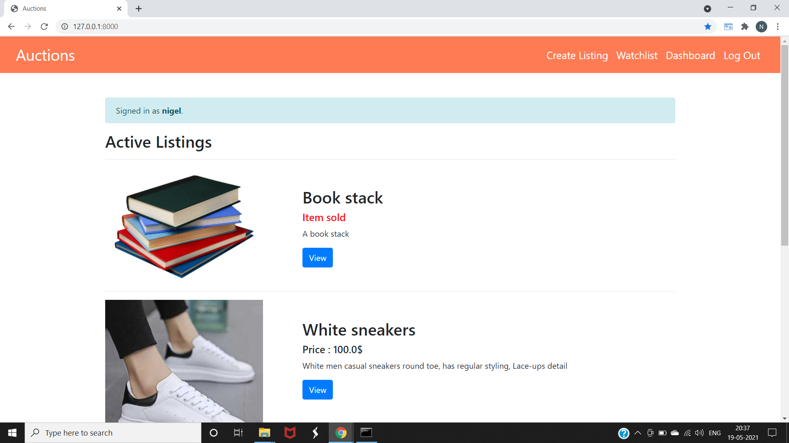
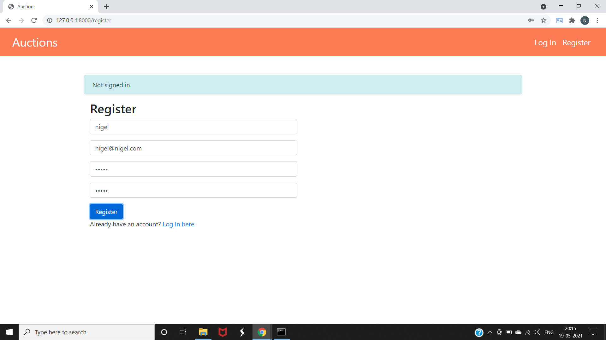
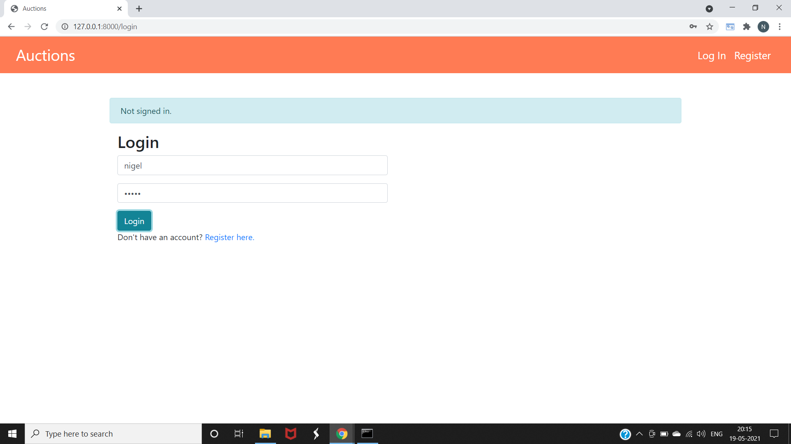
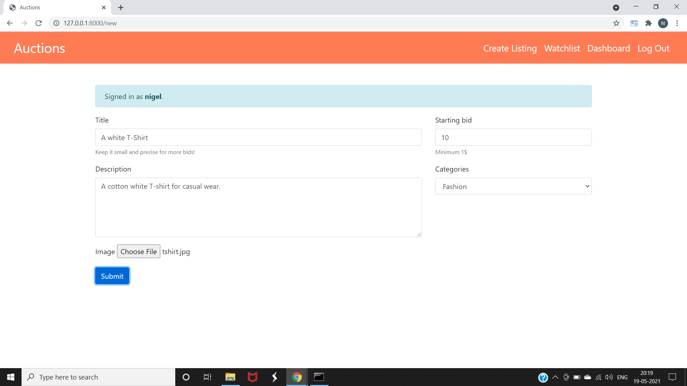
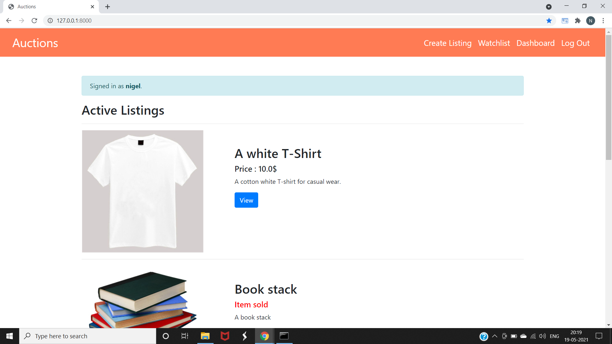
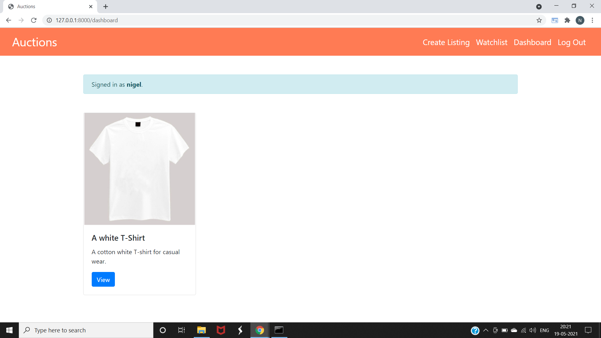
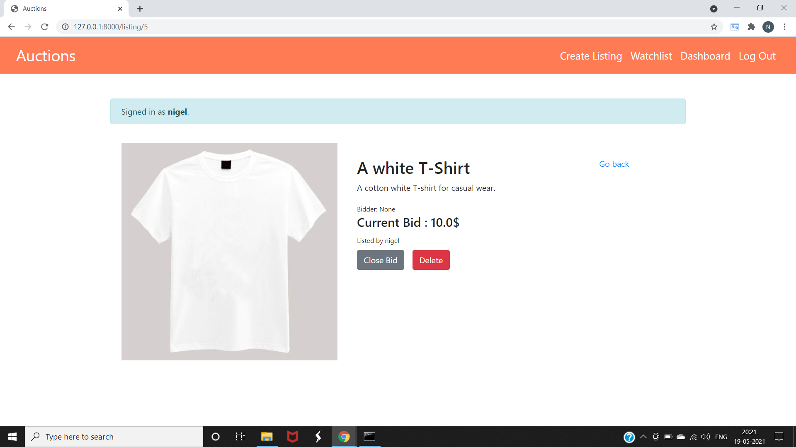

# auction-website
This project was implemented as a part of the course by [CS50's Web Programming with Python and JavaScript](https://www.edx.org/course/cs50s-web-programming-with-python-and-javascript).
### Description:
Creating an auction website where users can buy products by bidding as well as add listings of their products to be auctioned and sold.
### Functionality:
1. Users will be able to register themselves and then login. 
2. Users can bid on various products.
3. A user can create listings of the products he/she wants to sell.
4. Users will be provided with a dashboard to track their listings.
5. Users will be provided with a feature of watchlist in order to track the products of interest.
6. Users can browse various products on the platform.
### Demonstration:
1. **Index page:** All the listings are displayed here

Sold products will be promoted by ‘Item sold’ in red

2. **Registration page:**

3. **Login page:**

4. **Creating a listing:**

Listing gets added to the index page

5. **Dashboard:** Enables users to see their listings that they created

6. **Viewing the listing as the owner**

